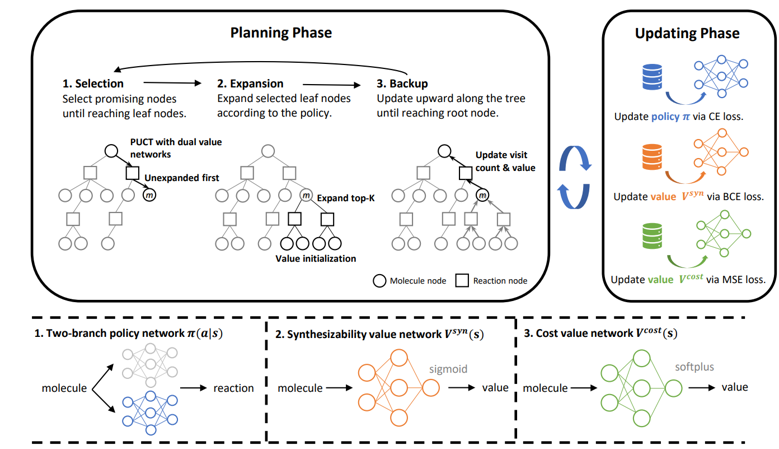

# Retrosynthetic Planning with Dual Value Networks

This repository contains the official implementation of our algorithm *Retrosynthetic Planning with Dual Value Networks* (ICML 2023), based on the open-source codebase of [Retro*](https://github.com/binghong-ml/retro_star).

## Overview


In this work, we aim at using reinforcement learning (RL) to fine-tune single-step retrosynthesis prediction models through simulated synthetic routes. The RL training is expected to improve both the (1) synthesizability and (2) route quality of the output routes while retaining the single-step accuracy of the SL pretrained model. We implement the PDVN algorithm described in our paper, and a parallel training framework to scale the training to a large amount of molecules. We also provide all the datasets (including ChEMBL-1000 and GDB17-1000) used in the paper.

## Setup

### Create conda environment
```bash
conda env create --file environment.yml
conda activate pdvn
```

### Download the necessary files
To reproduce the results in the paper, we also need the additional files containing the training dataset, evaluation datasets (USPTO, ChEMBL-1000, GDB17-1000), SL-pretrained model, starting molecules, and the template rules.
All the necessary files can be downloaded from the [link](https://drive.google.com/drive/folders/198WuPlSyMeMvvd4i2SM833jPAcGllzDu?usp=sharing), and should be copied into the `retro_star` folder.

## Training on USPTO training dataset

The PDVN training algorithm is implemented in `retro_mcts.py`, which iterates the sampling phase and the training phase. Checkpoints are saved in the folder `${RESULT_FOLDER}` after every `save_interval` number of molecules are trained. 

To enhance the sampling efficiency, we use `n_processes` to specify the number of processes used for sampling synthesis routes over the `n_gpus` number of GPUs. For example, `--n_processes 15 --n_gpu 3` means that 15 processes are used for sampling synthesis routes over 3 GPUs, and each GPU will handle 5 sampling processes. We also use `gpu` to select the GPU used for training the model.

```bash
# scripts/pdvn_training.sh
EXP_NAME=pdvn
RESULT_FOLDER=./results/pdvn/run1/

cd retro_star
python retro_mcts.py \
--name ${EXP_NAME} \
--starting_molecules dataset/origin_dict_canonical.csv \
--lr 1e-3 --minibatch_size 128 --batch_size 1024 \
--realistic_filter \
--n_epochs 3 --iteration 500 --num_simulations 100 --depth 15 --PUCT_coef 1.0 \
--runner parallel --gpu 3 --n_gpus 3 --n_processes 15 \
--save_model --save_interval 25000 --result_folder ${RESULT_FOLDER} \
--train_routes dataset/routes_train.pkl \
--test_interval 5000 --test_batch_size 128
```

## Evaluation on USPTO test dataset

After the training, we evaluate the model on the USPTO test dataset. This serves 2 purposes: (1) to assess the performance of the model, and (2) to choose the best checkpoint for evaluation on other datasets, e.g., ChEMBL-1000 and GDB17-1000.

The evaluation algorithm requires the `result_folder` and `test_routes` to be specified. The `result_folder` is the folder where the checkpoints are saved, and the `test_routes` is the dataset used for evaluation.

```bash
# scripts/evaluation.sh
RESULT_FOLDER=./results/pdvn/run1/
TEST_ROUTES=dataset/routes_possible_test_hard.pkl

cd retro_star
python test_plan.py \
--method retro \
--starting_molecules dataset/origin_dict_canonical.csv \
--realistic_filter \
--iteration 500 --gpu 0 \
--runner parallel --n_gpus 4 --n_processes 20 \
--result_folder ${RESULT_FOLDER} \
--test_routes ${TEST_ROUTES}
```

## Visualizing the results and choosing the best checkpoint
We also provide the script to visualize the results across all the checkpoints on the USPTO test dataset. This dataset also serves as the evaluation dataset for selecting the best checkpoint (highest success rate) to further assess the performance on other datasets, such as ChEMBL-1000 and GDB17-1000.

```bash
# scripts/plot.sh
RESULT_FOLDER=./results/pdvn/run1/
PLAN_INFO=retro_routes_possible_test_hard

cd retro_star
python plan_results_analyzer.py \
--result_folder ${RESULT_FOLDER} \
--plan_info ${PLAN_INFO}
```

## Evaluation on ChEMBL-1000 and GDB17-1000
After choosing the best checkpoint according to the USPTO test dataset, we combine the model with the retro*-0 planner (this can be replaced by other planners) to evaluate the ChEMBL-1000 and GDB17-1000 datasets.

```bash
# scripts/retro_star_search.sh
RESULT_FOLDER=./results/retro_star/chembl/
TEST_ROUTES=dataset/chembl_1000.pkl
BACKWARD_MODEL=<REPLANCE_THIS_WITH_BEST_MODEL>

cd retro_star
python retro_plan.py \
  --test_routes ${TEST_ROUTES} \
  --mlp_model_dump ${BACKWARD_MODEL} \
  --result_folder ${RESULT_FOLDER} \
  --iteration 500
```
To evaluate the GDP17-1000 dataset, replace the value of `TEST_ROUTES` with `dataset/gdb17_1000.pkl`.

## Citing PDVN
If you use PDVN in your research, please consider citing our work in the following BibTeX format:

```tex
@InProceedings{pmlr-pdvn,
  title = 	 {Retrosynthetic Planning with Dual Value Networks},
  author =       {Liu, Guoqing and Xue, Di and Xie, Shufang and Xia, Yingce and Tripp, Austin and Maziarz, Krzysztof and Segler, Marwin and Qin, Tao and Zhang, Zongzhang and Liu, Tie-Yan},
  booktitle = 	 {Proceedings of the 40th International Conference on Machine Learning},
  pages = 	 {22266--22276},
  year = 	 {2023},
  volume = 	 {202},
}
```
